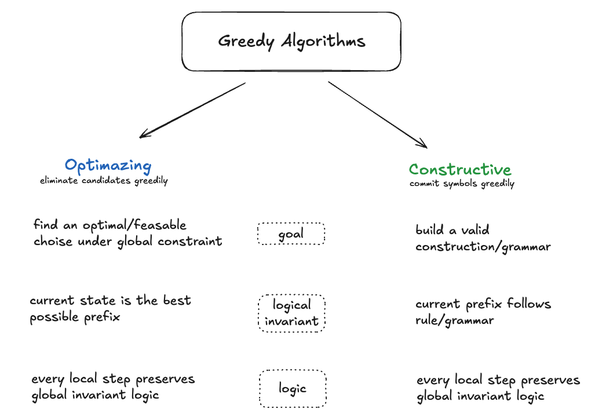

# Greedy Algorithms

## Pattern Categories

### [A. Optimizing Greedy Algorithm](optimizing_greedy_single_invariant.md)

Maintain global optimality through local invariants.

### [B. Constructive Greedy Algorithm](constructive_greedy.md)

Build valid structures through constraint-driven parsing.

---

#### The "Look-Ahead" Rule (+1)

In many Greedy problems, the decision each iteration requires a peek at the next state to preserve the invariant:

**Roman to Integer**: Peek `i + 1` to see if current is negative.

**Gas Station**: We don't peek `i + 1` in the code, but the logic "forces" us to start fresh from `i + 1` if the invariant is violated.
