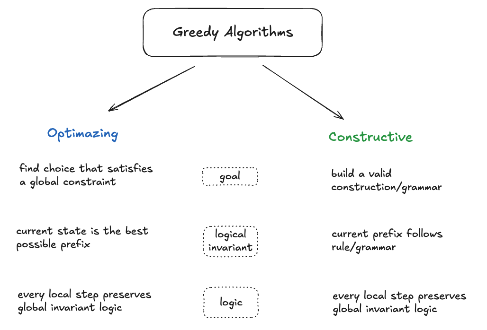

# Greedy Algorithms

  

## Pattern Categories

| 📈 [Optimizing Greedy](optimizing_greedy.md) | 🏗️ [Constructive Greedy](constructive_greedy.md) |
| :--- | :--- |
| Focus on maintaining global optimality through **local invariants**. | Focus on building valid structures through **constraint-driven parsing**. |

---

> [!IMPORTANT]
> ### 💡 The "Look-Ahead" Rule (+1)
> A common greedy tactic where the current decision depends on the **next state** to preserve the invariant.

#### 🛠️ Application in Problems:

* **Roman to Integer** We peek at `i + 1`. If the current numeral is smaller than the next, it indicates a subtraction rule (e.g., IV, IX).
* **Gas Station** restart at `i + 1` if there's not enough gas to proceed.