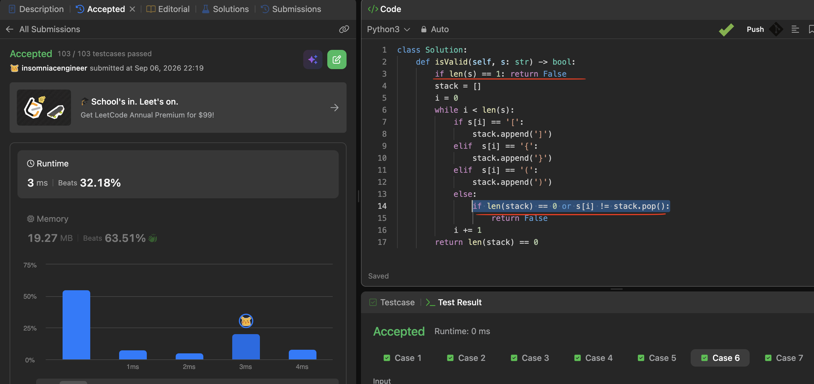

Refs:

[HelloInterview: Stack](https://www.hellointerview.com/learn/code/stack/overview)
[HelloInterview: Monotonic Stack](https://www.hellointerview.com/learn/code/stack/monotonic-stack)

----

 [20. Valid Paretheses](../../problems/0020-valid-parentheses/)



1. Valid paretheses can't have only 1 bracket
2. If stack is empty - it means that the parenthesis is broken (no corresponding closing bracket)
3. Optionally - we can add all brackets to map and add values to stack

[155. Min Stack](../../problems/0155-min-stack/)

1. Pop/push/top - O(1) for list
2. getMin requires actual traversing which is O(n)

Solution: one list for pop/push/top, another - updating min for each iteration. When we pop - pop from synced list as well.

```python
    # 1 2 0 stack
    # 1 2 2 sync_stack
```

[150. Evaluate Reverse Polish Notation](../../problems/0150-evaluate-reverse-polish-notation/)

1. Result is a **SUM** of all operations done
2. .lstrip("-").isdigit() to check negative values
3. Order is important for - and /
4. Result is stack[-1] last element

[739. Daily Temperatures](../../problems/0739-daily-temperatures)

1. Monotonic stack problem - use stack for storing **indexes**
2. Pre-fill answer list with 0 for temperatures that doesn't have any higher one
```python
res = [0] * len(temperatures)
```
3. If we have element higher than top stack one - we pop it and update result
```python
        for t_idx, t in enumerate(temperatures):
            while stack and temperatures[stack[-1]] < t:
                prev_idx = stack.pop()
                ans[prev_idx] = t_idx - prev_idx
            stack.append(t_idx)
```

[853. Car Fleet](../../problems/0853-car-fleet)

1. cars = sorted(zip(position, speed), reverse=True) sort input by position from the end
2. if max_time < current_time left - it's a fleet
